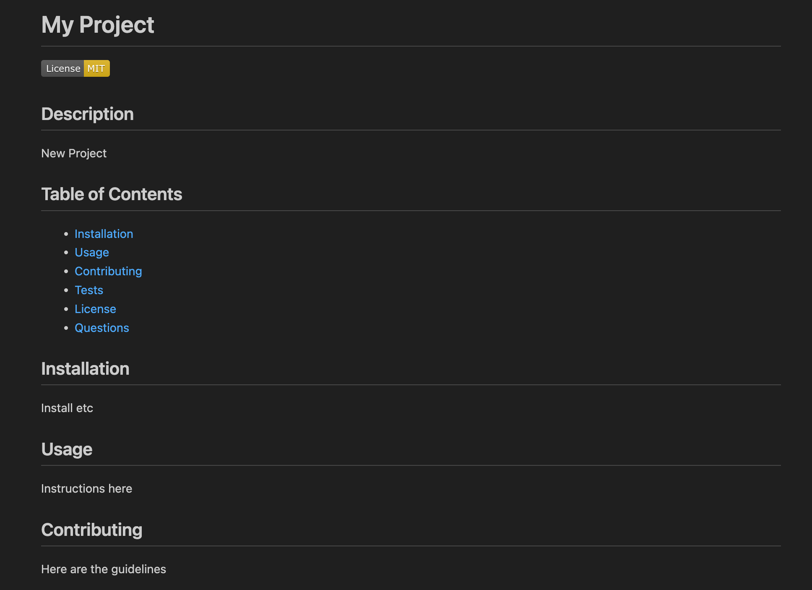
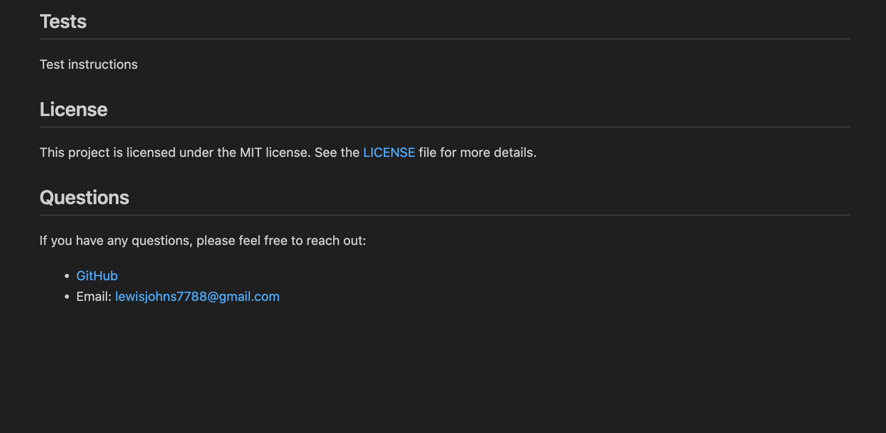

# Professional_README_Generator
This is a README generator that a developer can use to create a professional README for a new project.
The user is prompted with a series of questions, including what to title their README, as well as the option to choose what license they are using, or if they are using no license. 
They are also asked for their github username and email before their information is displayed in the new README. 
In the README, The information that the user had entered is added to the sections of the README entitled Description, Installation, Usage, Contributing, and Tests. A badge for their chosen license is displayed. 
There are links to their given github and email. When the user clicks on each section of the table of contents they are taken to that section. 
https://github.com/lewisgjohns/Professional_README_Generator/tree/main

